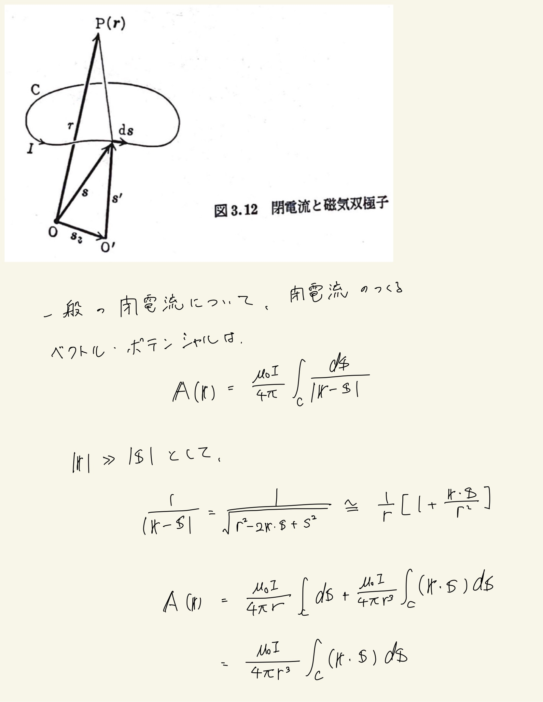
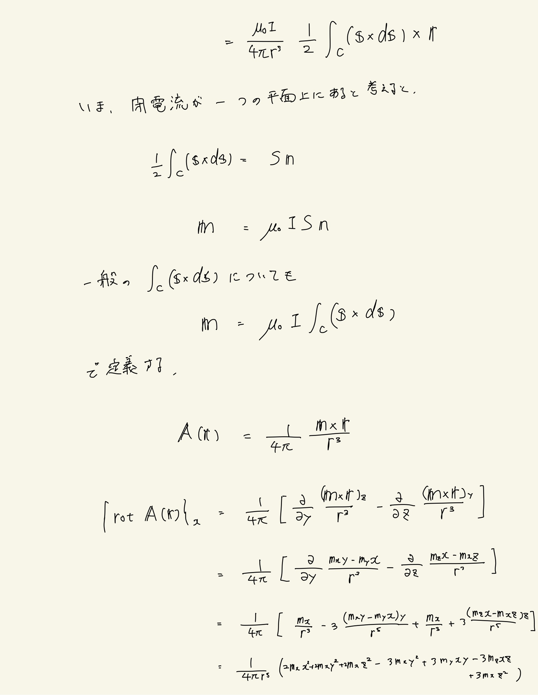
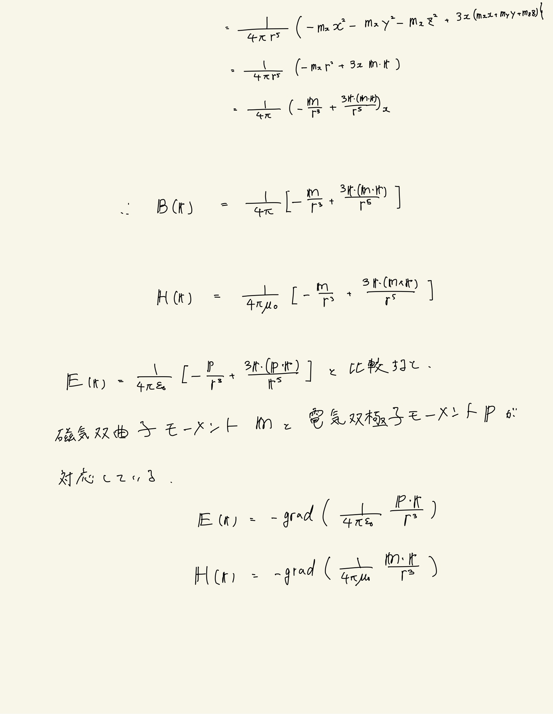

# 電流と磁場
## 例題6 閉電流と磁気双極子

#### 結論

磁気双極モーメントベクトル： $ \mathbf{m} = \mu_0 I \cdot \frac{1}{2} \oint_C ( \mathbf{s} \times d\mathbf{s} ) $
 
$ \mathbf{A} (\mathbf{r}) = \frac{ 1 }{ 4\pi } \frac{ \mathbf{m} }{ r^3 } $
 
$ \mathbf{B} (\mathbf{r}) = \frac{ 1 }{ 4\pi } [ \frac{\mathbf{m}}{r^3} + \frac{ \mathbf{r} \cdot ( \mathbf{m} \cdot \mathbf{r} ) }{r^5} ] $
 
$ \mathbf{H} (\mathbf{r}) = \frac{ 1 }{ 4\pi\mu_0 } [ \frac{\mathbf{m}}{r^3} + \frac{ \mathbf{r} \cdot ( \mathbf{m} \cdot \mathbf{r} ) }{r^5} ] $
 
 

#### 方針
一般の閉電流のつくるベクトル・ポテンシャルを磁気双極子モーメントに置き換えるところからスタートする。
 
 

#### 導出

