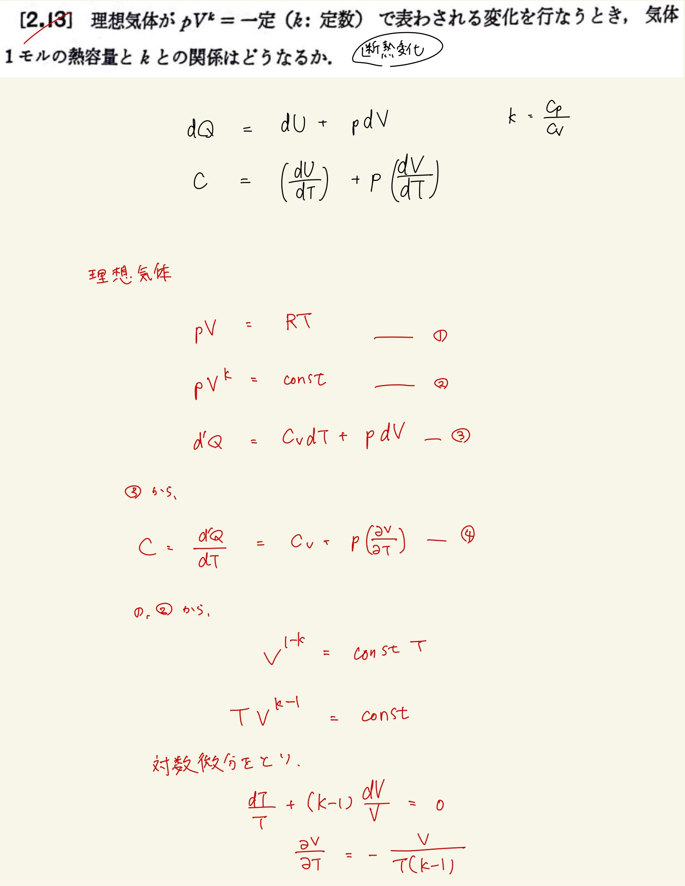
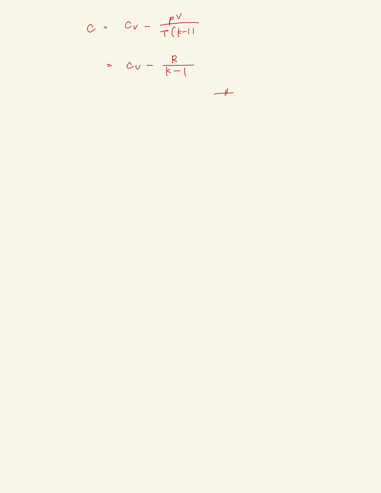

# 熱力学第一法則
## 2.13 理想気体の熱容量と定積熱容量/定圧熱容量の関係式

$ d'Q = dU + pdV $
 
$ dU = ( \frac{ \partial U }{ \partial T } ) _ V dT + ( \frac{ \partial U }{ \partial V } ) _ T dV $
 
$ dU = C_V dT + ( \frac{ \partial U }{ \partial V } ) _ T dV $
 
$ d'Q = C_V dT + [ ( \frac{ \partial U }{ \partial V } ) _ T + p ] dV $
 
 

