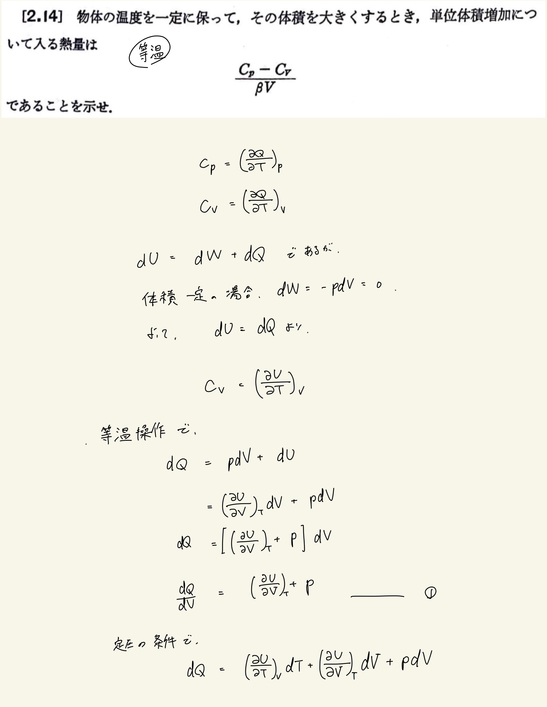
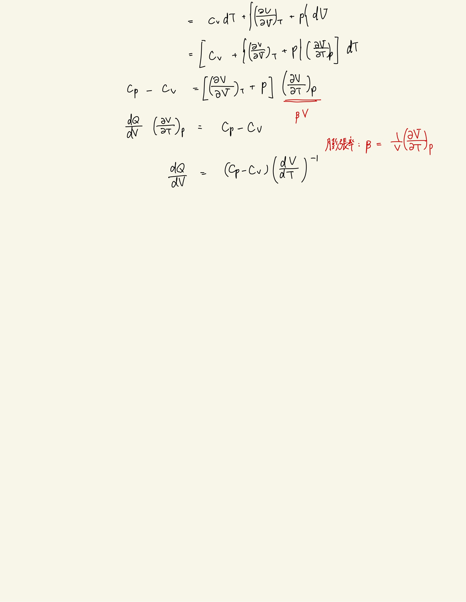

# 熱力学第一法則
## 2.14 等温での単位体積増加について入る熱量

#### ポイント

等温操作で単位体積あたりの熱量は、
 
$ ( \frac{ \partial Q }{ \partial V } ) _ T = ( \frac{ \partial U }{ \partial V } ) _ T + p $
 
これを等圧熱容量と等積熱容量の式と比べて等式を示す。
 
 

