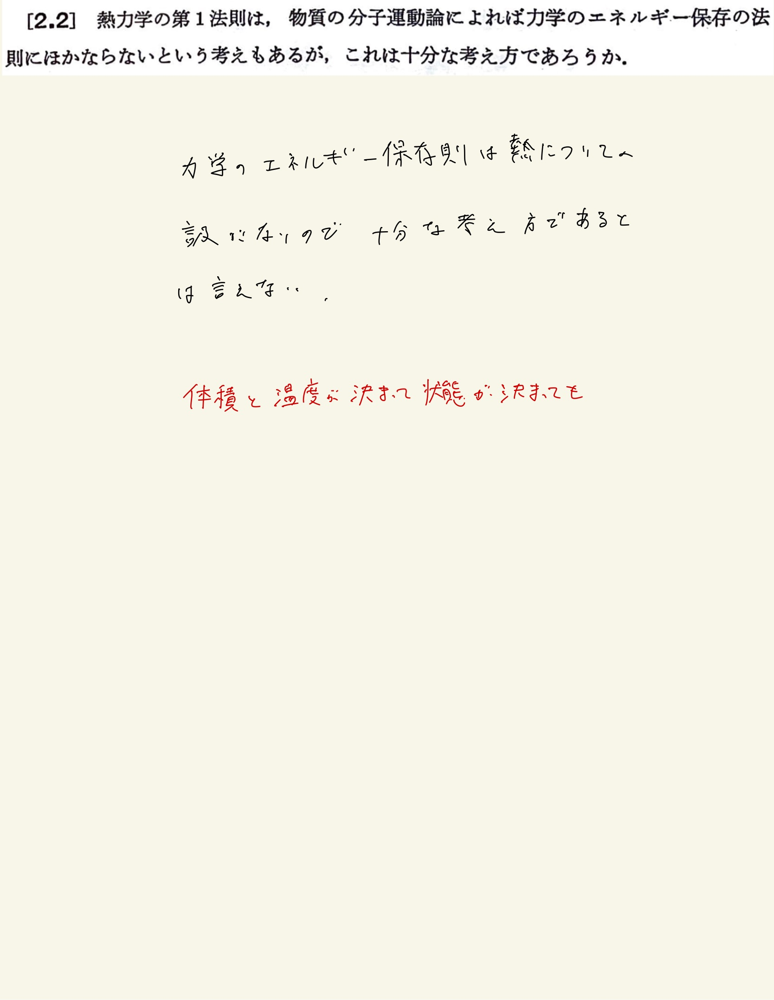

# 熱力学第一法則
## 2.2 熱力学第1法則と力学的エネルギー保存則

#### 解説

物体の持つ内部エネルギーの増減は、ピストンのような巨視的な部分の動きによる仕事ばかりでなく、壁との相互作用（主として分子と壁との衝突による分子的な力学的エネルギーの授受）によるものである。それゆえ、外から仕事を受けただけ、また外の位置エネルギーなどの力学的エネルギーの減少量だけ物体の分子的の力学的エネルギーが増すことは明らかである。
 
しかし、たとえば体積と温度が決まって状態が決まっても、分子のエネルギーの総和が決まるかどうかはすぐにはわからない。つまり、体積と温度が与えられても物体を構成する分子の力学的エネルギーの総和が一義的に決まるかどうかは、物質の分子運動論または統計力学と熱力学第1法則などをもとにする熱力学の理論との対比によって、はじめてきめられるのである。
 
それゆえ、分子のエネルギーが力学的エネルギーにほかならないというだけでは熱力学第1法則の代わりを全部したことにはならない。
 
 

