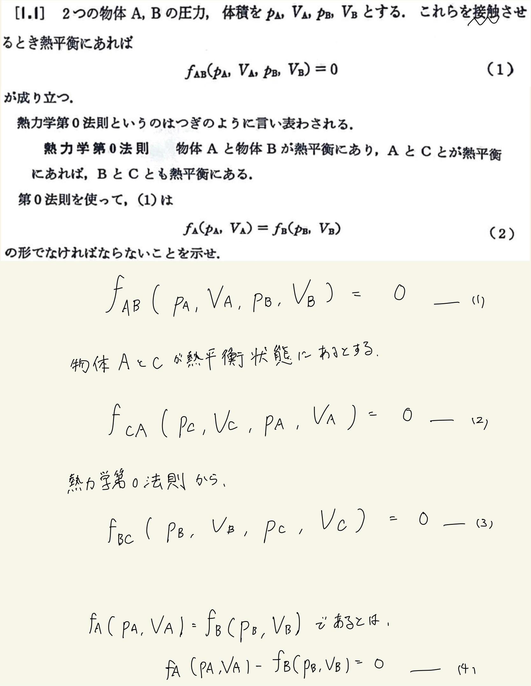
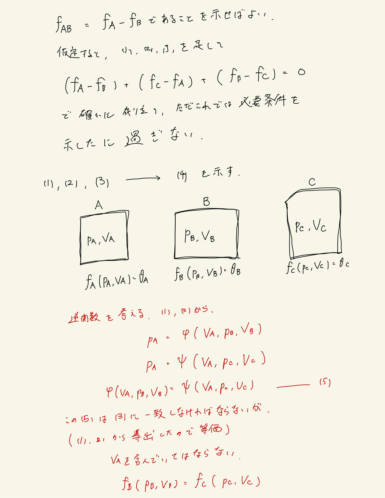
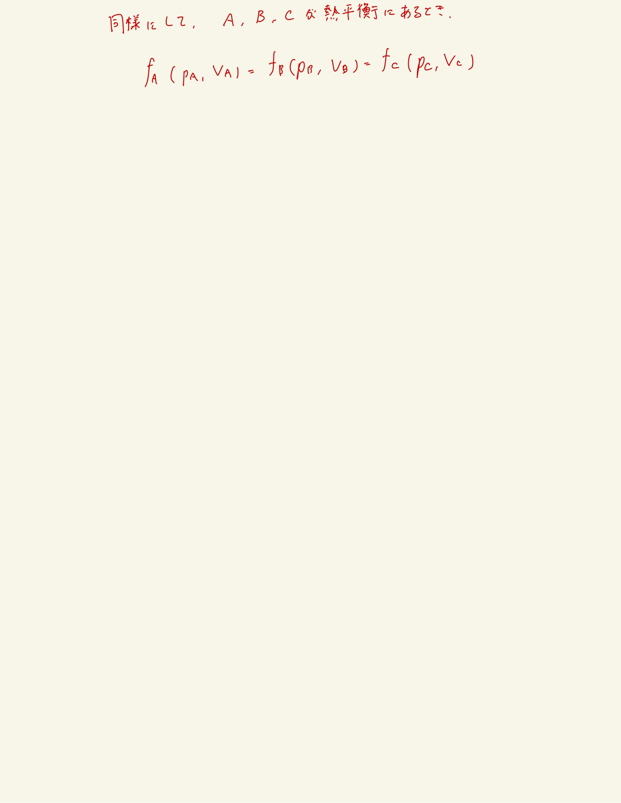

# 熱力学の基礎
## 1.1 熱力学第0法則

#### 方針

$ f_{AB}, f_{AC} $の$ p_A $についての逆関数を考える。
 
 

#### ポイント

$ \varphi (V_A, p_B, V_B) = \psi (V_A, p_B, V_B) ... (5) $という等式が成り立つが、これは(3)式と同等のはずである。←これがよくわからんかったけど
 
$ (1), (2) $の仮定から$ (5) $が成り立つ。
 
熱力学第0法則から、$ (3) $が成り立つ。$ (3) $が主張することは、
 
「$ (1), (2) $を使って$ p_B, V_B, p_C, V_C $について成り立つ関係式が導けるよ」
 
ということ。すなわち、$ (5) $を補完するような情報を与えている。
 
 
まぁわかりにくければ$ (5) $に対して熱力学第0法則を使ったと言い換えればよい。

 
 

#### 補足

理想気体について
 
$ p_1 V_1 - p_2 V_2 = 0, p_1 V_1 - p_3 V_3 = 0 $
 
$ p_1 = \frac{p_2 V_2}{V_1}, p_1 = \frac{p_3 V_3}{V_1} $
 
$ \frac{p_2 V_2}{V_1} = \frac{p_3 V_3}{V_1} $
 
$ p_2 V_2 - p_3 V_3 = 0 $