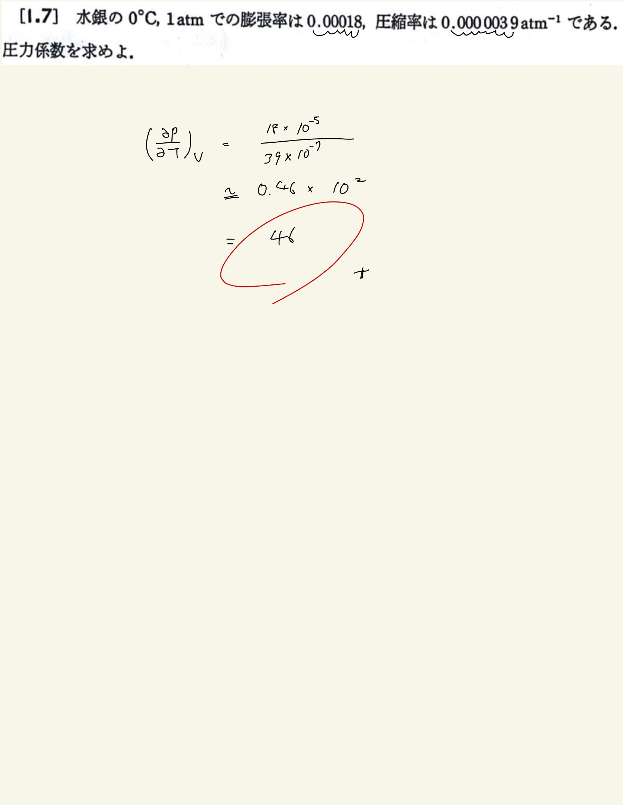

# 熱力学の基礎
## 1.7 圧力係数 

#### ポイント

(圧力係数) $ = (\frac{\partial p}{\partial T})_V = \frac{ \frac{1}{V} ( \frac{ \partial V }{ \partial T } )_p }{ - \frac{1}{V} ( \frac{ \partial V }{ \partial p } )_T } = \frac{ \beta }{ \kappa } $
  
 

