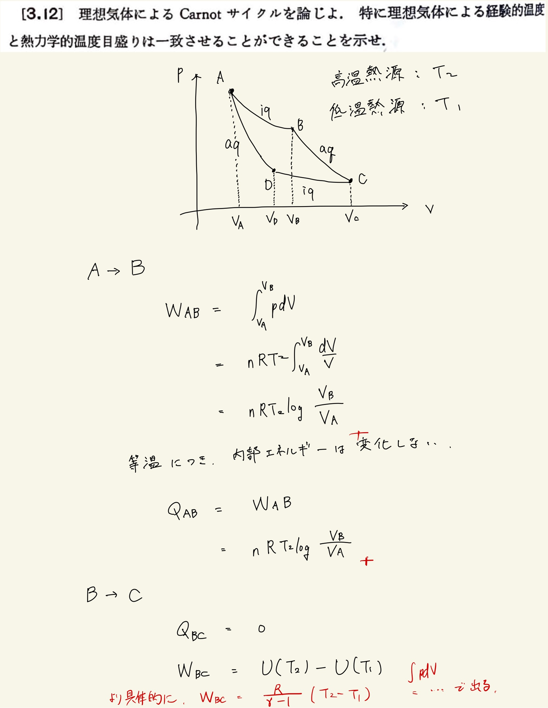
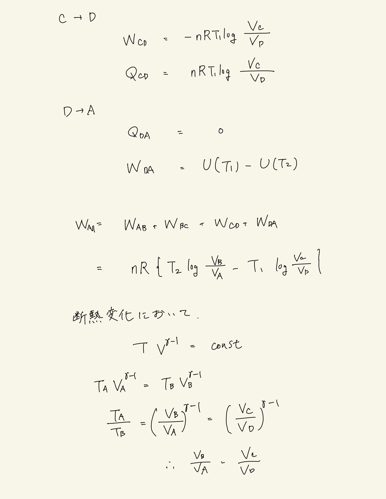
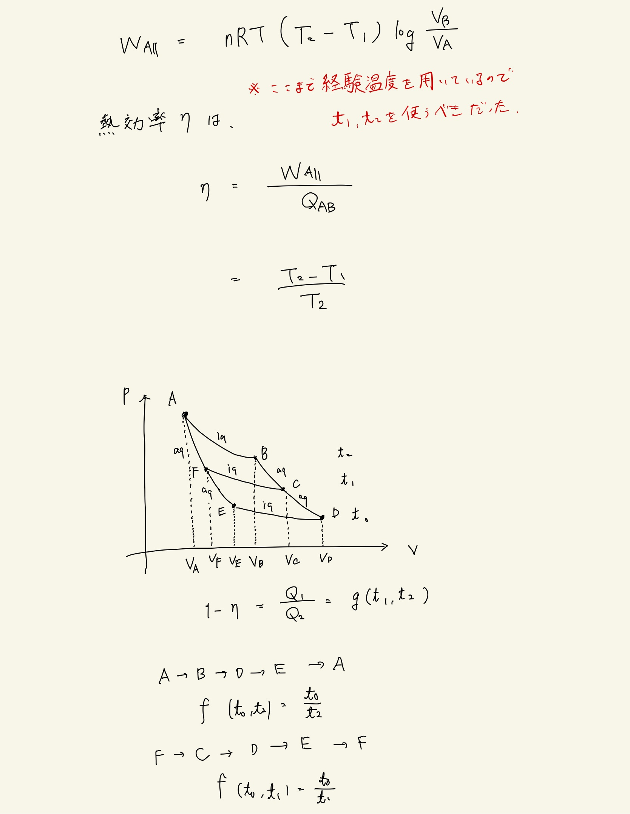
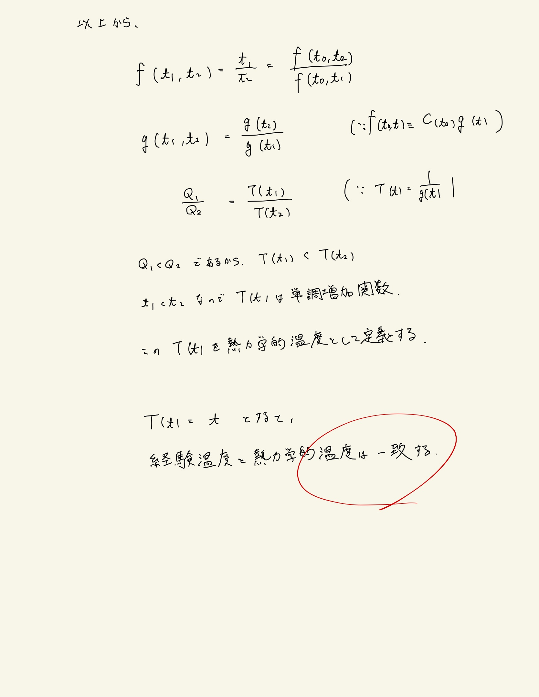

# 熱力学第2法則 エントロピー
## 3.12 理想気体による$\mathrm{Carnot}$サイクル

#### ポイント

理想気体によるサイクルを論じる際には、

- 熱力学第1法則
    - $ dU = d'Q + d'W $
- 状態方程式 
    - $ pV = nRT $
- 定積熱容量
    - $ dU = C_V dT $
- 断熱操作 
    - $ pV^{ \gamma } = \mathrm{const} $
    - $ TV^{ \gamma - 1 } = \mathrm{const} $
    - $ Tp^{\frac{1 - \gamma }{ \gamma }} = \mathrm{const} $
- 等温操作
    - $ pV = \mathrm{const} $
- マイヤーの関係式 
    - $ C_p - C_V = nR $

 
が大体必要になる。
 
これらの関係式を利用して、それぞれの操作について仕事と熱を計算していく。
 
 

#### 重要

$ \mathrm{Carnot} $サイクルの効率は熱源の温度のみで決まるのであった。これを使って。熱力学的温度を定義することができるようになる。
 
熱力学的温度が経験温度に一致することの証明は3個の$ \mathrm{Carnot} $ サイクルを使って示す。

 
 

