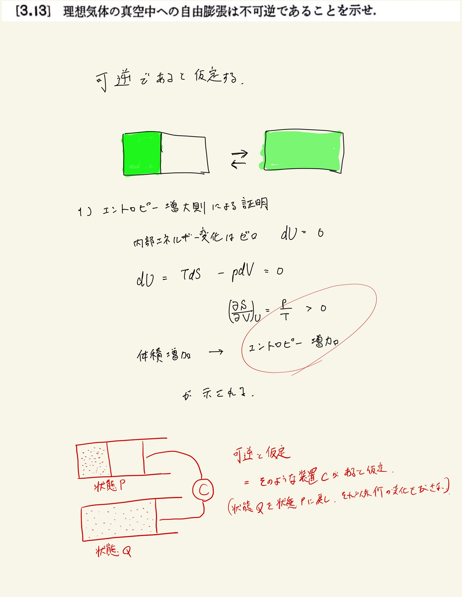
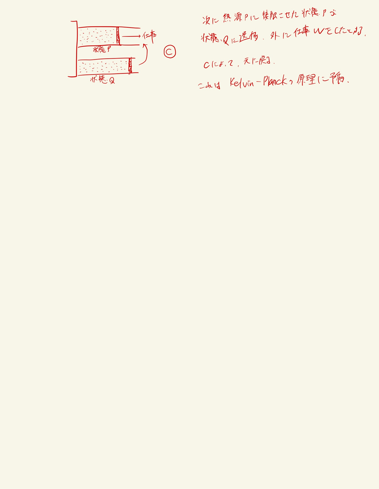

# 熱力学第2法則 エントロピー
## 3.13 理想気体の真空中への自由膨張の不可逆性

#### ポイント

何度も言うように、不可逆であるとはいかなる(他になんの変化も及ぼさない)操作を以てしても元の状態に戻らないような操作のことをいう。

#### 方針

さて、この問題では、自由膨張を可逆にするようなサイクルを想定し、これを等温操作において用いることで熱力学第2法則との矛盾を導き出している。
 
このように、元々考えていた操作に熱源を用いることができない場合には別のサイクルを用意してそのサイクルから矛盾を導けばよい。
 
 

