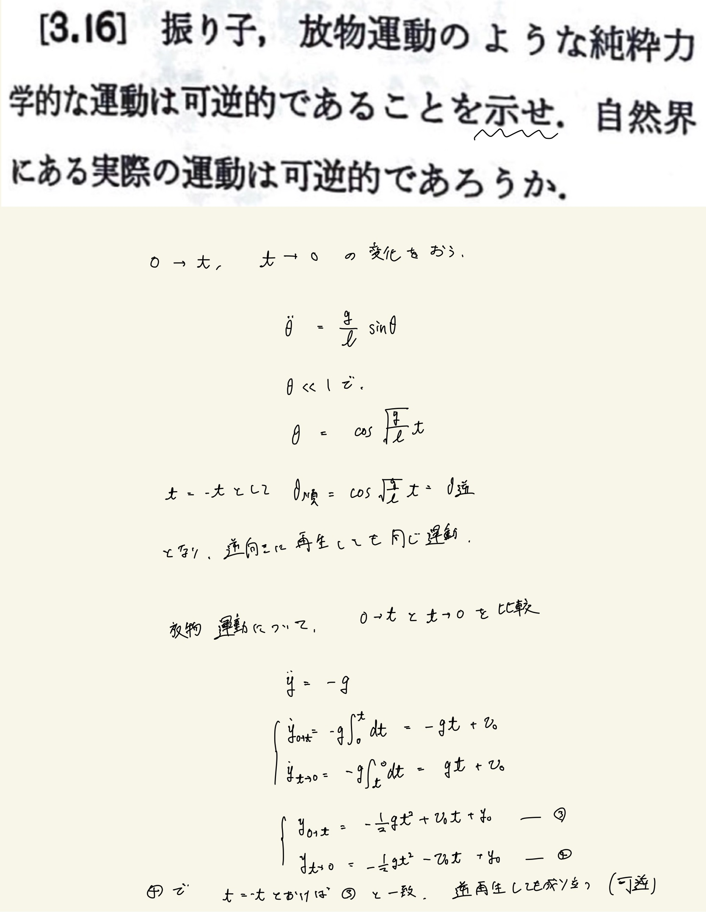
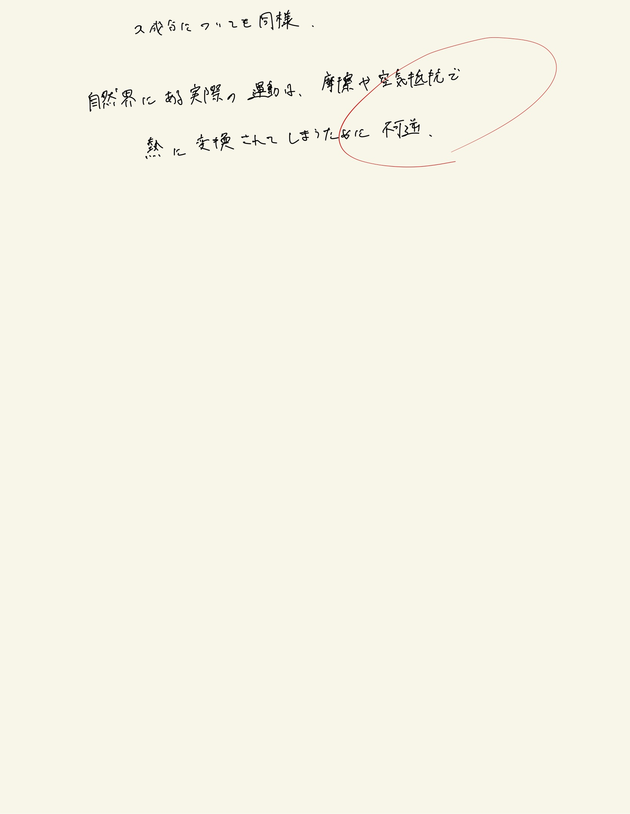

# 熱力学第2法則 エントロピー
## 3.16 純粋力学的な運動の可逆性

#### ポイント

逆再生したとき(tにマイナスを掛けたとき)、速度成分のみ負号が掛かる。
 
 
解説では、周期的な運動に着目して示していた。
 
例えば、放物運動の$y$が放射点と一致する点に放射点までつながったU字菅を設置しておけば、力学的エネルギー保存則からスタート地点まで戻ってくれるからこれは周期的な運動になる。よって、可逆的である。
 
 

