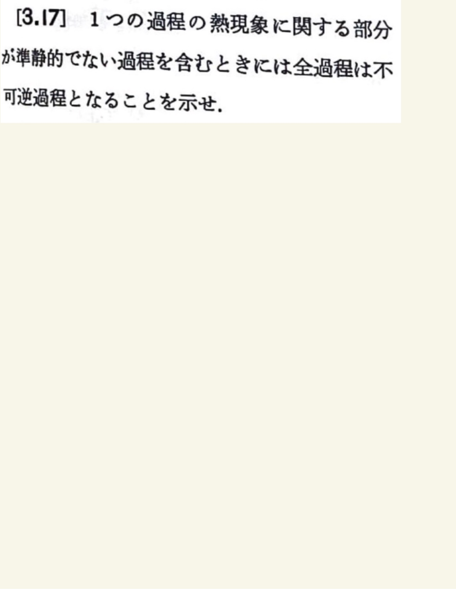

# 熱力学第2法則 エントロピー
## 3.17 準静的でない過程を含む過程の不可逆性

#### ポイント

熱現象に属する部分で準静的でないものがある場合には、必ず温度が有限にちがう部分の間の熱伝統、摩擦により熱を移したのと同じ効果(熱の発生)、密度の違う部分での膨張などの不可逆であることが第2法則により証明されている現象を含むから。
 
 
普通にこれまでにやってきたことと同値では？と思ったんだけど、例を示してやればよかったっぽい。
 
 

