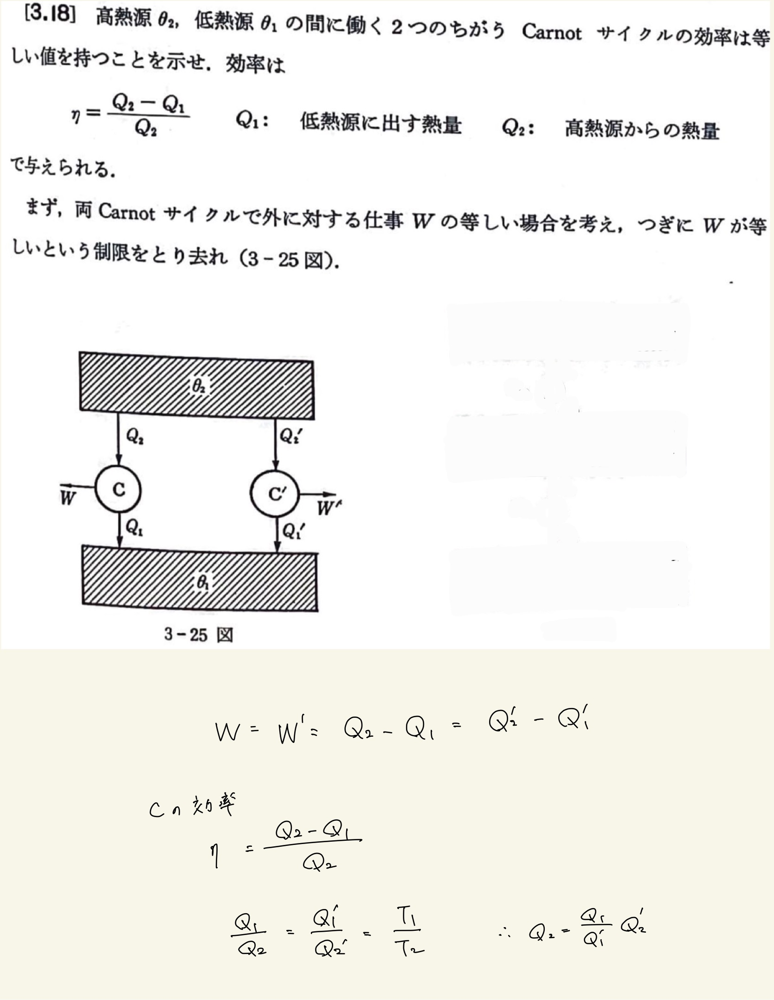
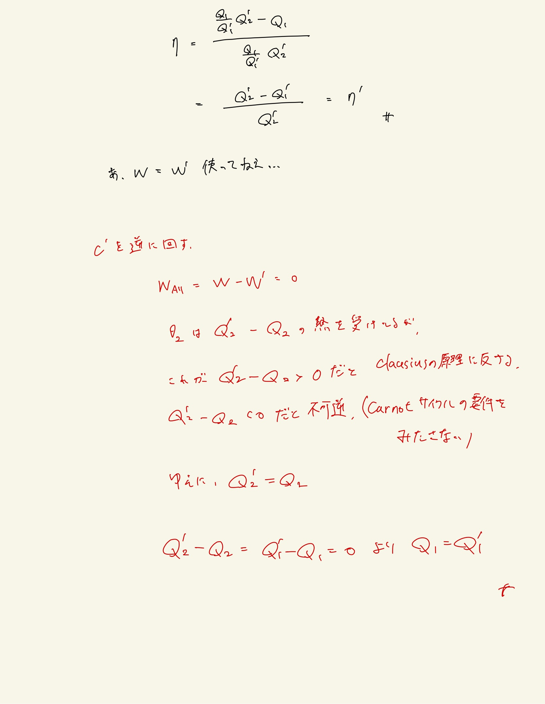

# 熱力学第2法則 エントロピー
## 3.18 Carnotサイクルの効率

#### ポイント

$ \mathrm{Carnot} $ サイクルの効率はどんな過程でも等しい。

 
 
そらまぁ過程を考えずに「受け取る熱」「外にする仕事」「放出する熱」のみで定義してるんだから過程が異なっていようが効率は変わらんだろという自明な問題。
 
$W$が等しいという制限を取り去れという要請が解説読んでもよくわからんかった。
 
 

