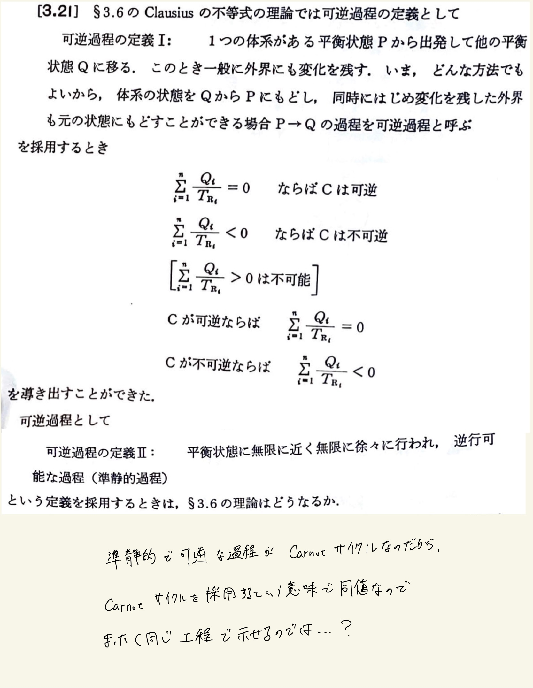

# 熱力学第2法則 エントロピー
## 3.21 Clausiusの不等式

#### ポイント

$ \mathrm{Clausius} $ の式を扱いやすい形にすると、
 
$ \frac{Q_1}{T_1} + \frac{Q_2}{T_2} = 0 $
 
自分の回答から思考過程が読み取れないんだけど(第2式→第3式で期待の状態方程式を代入するなら$p$はどこにいった？)、理想気体の等温操作での受け取る熱=仕事で、仕事の式から熱を出して$ \mathrm{Clausius} $の式に代入すれば体積の比が求まる。
 
 

