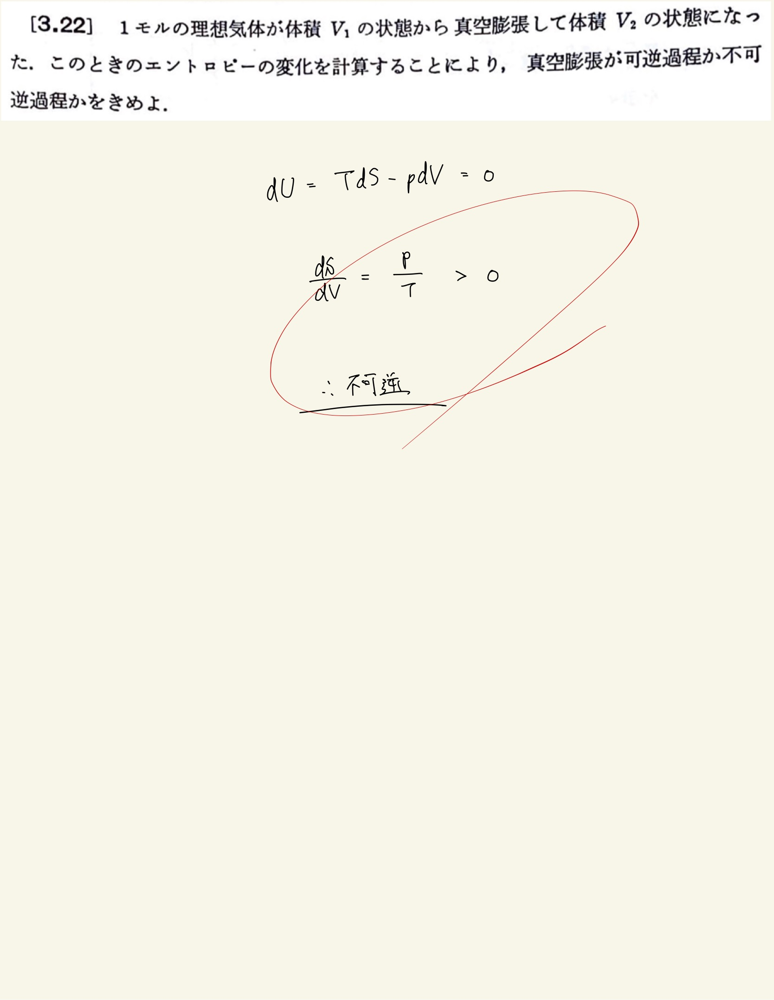

# 熱力学第2法則 エントロピー
## 3.22 理想気体の真空膨張でのエントロピー

#### ポイント

$ ( \frac{ \partial U }{ \partial V } )_T = 0 $
 

#### 補足

$ \Delta S = \int_{V_0} ^ {V_1} \frac{p}{T} dV = R\log \frac{V_1}{V_0} > 0 $
 
からエントロピーが増大している→不可逆であると言える。
 
 

