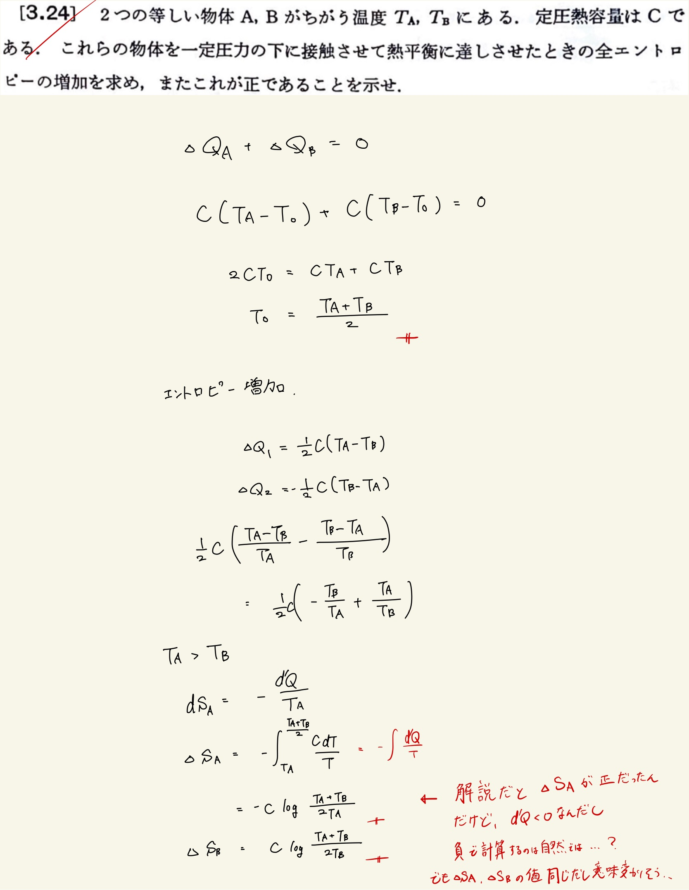
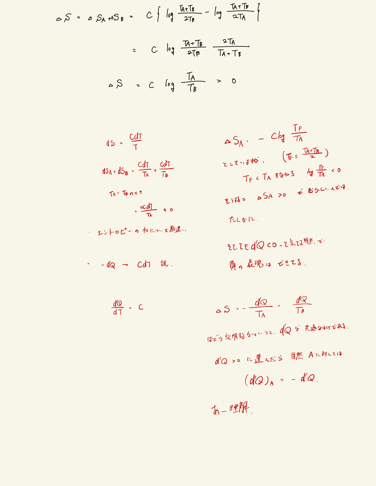

# 熱力学第2法則 エントロピー
## 3.24 温度の違う同じ物体の接触によるエントロピー増加

#### ポイント

定圧熱容量が与えられているとき、
 
$ \Delta S = \int \frac{CdT}{T} $
 
考え方は正しかったけども符号が逆でダメでした。
 
$ \log \frac{A}{B} (A < B)  < 0 $
 
であることは意識しておくべき。
 
 

