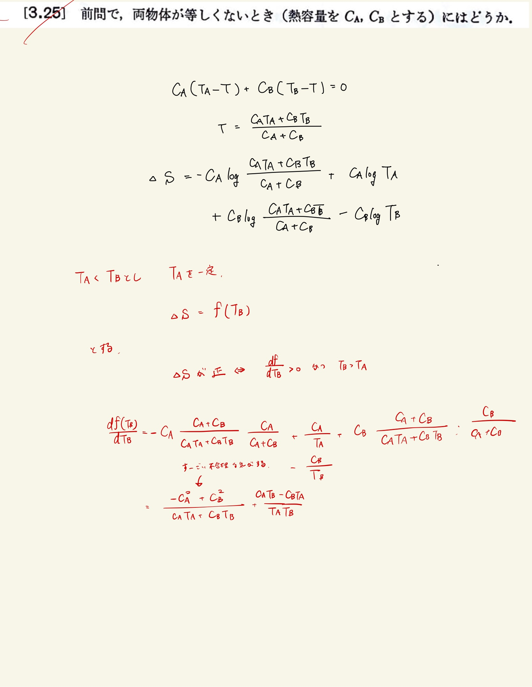

# 熱力学第2法則 エントロピー
## 3.25 温度の違う等しくない物体の接触によるエントロピーの増加

#### ポイント

$ \Delta S $ の計算まではあってる。
 
最大値求めるの難しいよな。$T_A$を固定してエントロピーを$T_B$の関数として見る。
 
$T_B$のほうが大きく、$ T_A = T_B $で$ \Delta S = f(T_A) = 0 $なので$f(T_B)$が単調増加であれば必ず常に正となる。
 
これも前問と同様にして負になってるので直す。
 
 

