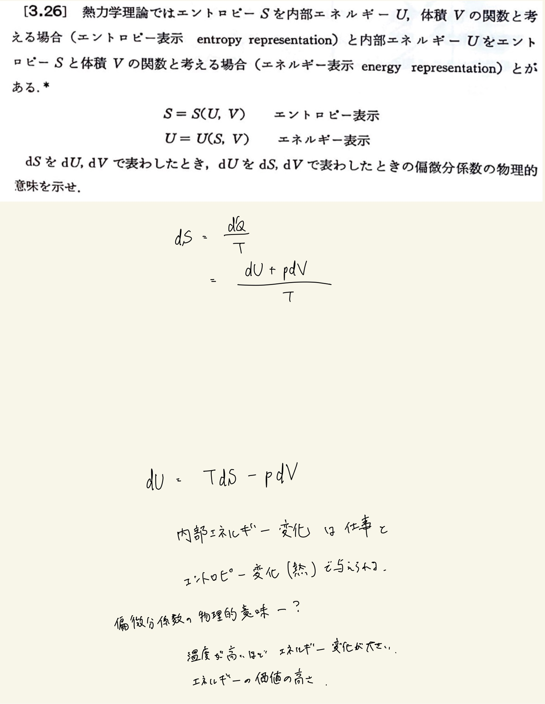

# 熱力学第2法則 エントロピー
## 3.26 偏微分係数の物理的意味

#### 解答

$ dU = TdS - pdV $
 
$ T = ( \frac{ \partial U }{ \partial S } ) _ V $
 
$ p = - ( \frac{ \partial U }{ \partial V } ) _ S $

 
 

$ dS = \frac{1}{T} dU + \frac{p}{T} dV $
 
$ \frac{1}{T} = ( \frac{ \partial S }{ \partial U } ) _ V $
 
$ \frac{p}{T} = ( \frac{ \partial S }{ \partial V } ) _ U $

 
 

