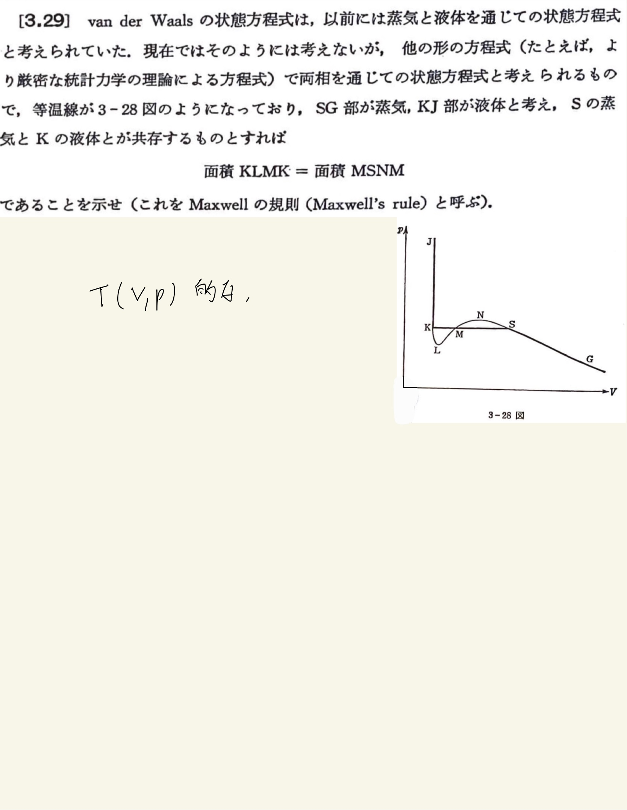

# 熱力学第2法則 エントロピー
## 3.29 van der Waals状態方程式におけるMaxwellの等面積則

#### ポイント

2相共存点ではギブス自由エネルギーが等しい。

 
 

#### 解答

$ dG = - SdT + Vdp $
 
等温線に沿って積分したら、$ dT = 0 $だから、
 
$ G = G(K) + \int Vdp $
 
$ \because $ $A$点でのギブス自由エネルギーを基準点にとった。
 
ところで、2相共存点においてギブス自由エネルギーは等しいから、
 
$ G(K) = G(K) + \int_K^S Vdp = G(S) $
 
すなわち、
 
$ \int_K^S Vdp = 0 $
 
$ \int_K^M Vdp + \int_M^S Vdp = 0 $
 
$ | \int_K^M Vdp | = | \int_M^S Vdp |  $
 
 

