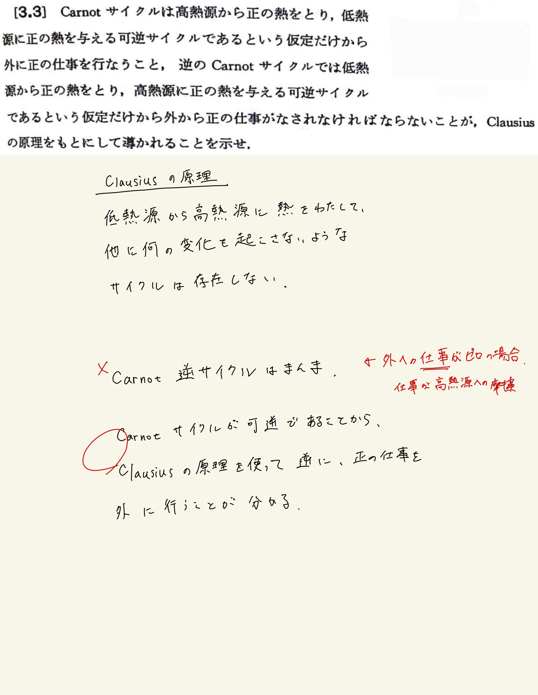

# 熱力学第2法則 エントロピー
## 3.3 熱力学サイクルの制約($\mathrm{Clausius}$の原理)

#### ポイント

$\mathrm{Clausius}$の原理から、高温熱源から熱を受け取り外に正の仕事を行う機関は、必ず低温熱源に熱を捨てないとサイクルとして機能しない。

 
 

#### 間違えたとこ

$\mathrm{Carnot}$逆サイクルについて、否定なので、外にする仕事$ W \leqq 0 $で議論しないといけなかった。$ W = 0 $の場合はなんの変化もなしに低温熱源から高温熱源から熱がうつっているので当然$\mathrm{Clausius}$の原理に反し、$ W > 0 $の場合は、その仕事を高温熱源への摩擦に使うことで高温熱源に$ W + Q $の熱が移っていることになりこれも$\mathrm{Clausius}$の原理に反する。

 
 

