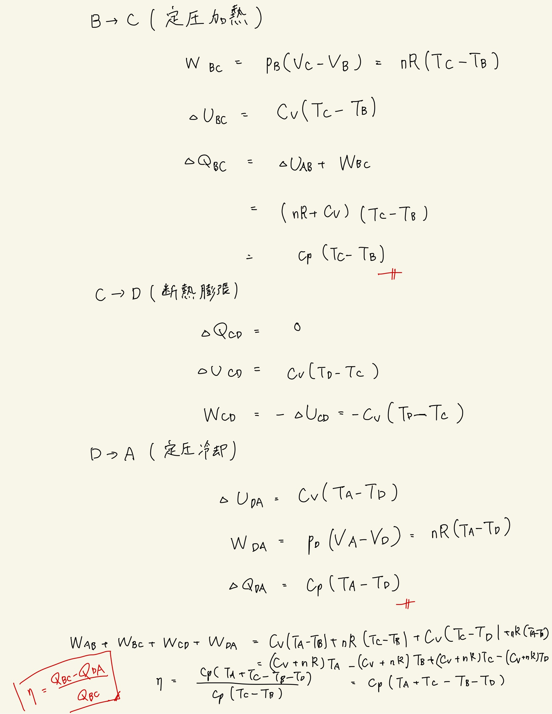

# 熱力学第2法則 エントロピー
## 3.32 ジュール・エンジン

#### ポイント

エンジンの効率は熱の収支さえわかれば求められる。

 

$ Q_{BC} = C_p(T_C - T_B) $
 
$ Q_{DA} = C_p(T_D - T_A) $
 
$ \eta = 1 - \frac{Q_{DA}}{Q_{BC}}$
 
あとは$\mathrm{Poisson}$の関係式から$p$の関数にすればよい。
 
 

