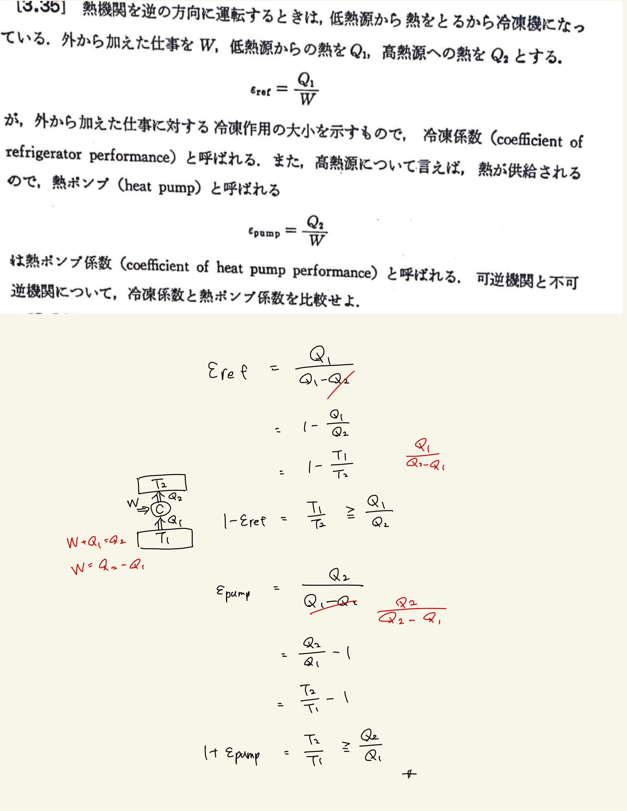
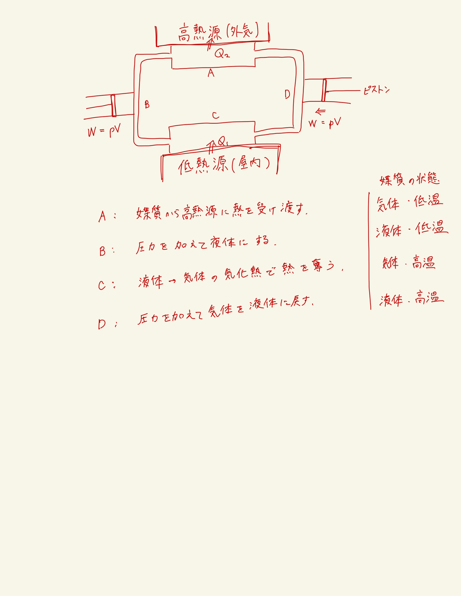

# 熱力学第2法則 エントロピー
## 3.35 冷凍機の冷凍係数/熱ポンプ係数

#### ポイント

$ T_2 \rightarrow T_1 $の極限では、$\varepsilon_{ref},\varepsilon_{pump}$ともに無限大になるのに対して、$ T_1 = 0 $の極限では、冷凍係数はゼロになりどんなに仕事を加えても冷凍されないのに対し、熱ポンプ係数は1になり外からの熱に等しい熱が高熱源のほうに汲み取られる。
 
 

