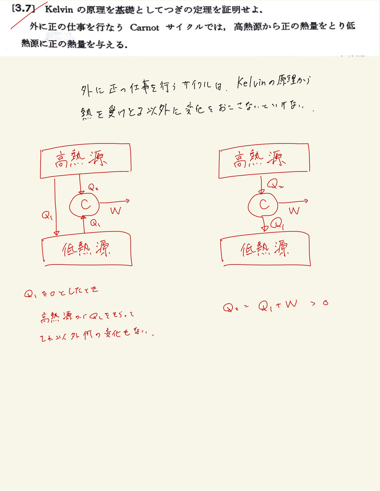

# 熱力学第2法則 エントロピー
## 3.7 熱力学サイクルの制約($ \mathrm{Kelvin} $の原理)

#### ポイント

サイクルに渡した熱量だけ高熱源から低熱源に熱を渡すと(熱力学第2法則に矛盾しない)、低熱源は元に戻るので結局高熱源から$ Q_2 - Q_1 $の熱を受け取るだけで仕事をするサイクルになってしまっている。

 
 

#### 展開

「低熱源から熱量をとる」としたときに$ \mathrm{Kelvin} $の原理に矛盾する。
 
そうして、正の仕事を行う、かつ低熱源から正の熱量を与えると言う情報から、高熱源からは正の熱源を受け取ると結論づけられる。

 
 

