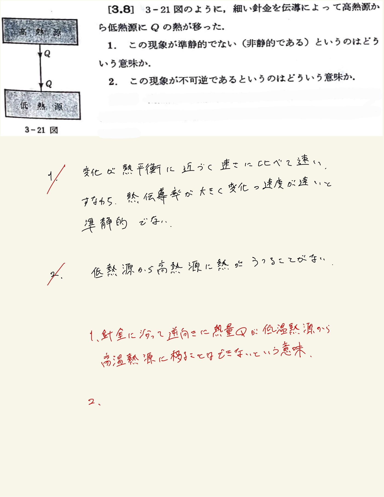

# 熱力学第2法則 エントロピー
## 3.8 高熱源と低熱源の接触の不可逆性

#### ポイント

準静的な過程$ \leftrightarrows $可逆
 

2.がよくわからん
 
とりあえず書き下してみる。
 
$Q$の熱が高熱源から低熱源に移った後、どんな方法によっても低熱源から$Q$の熱を取って等しい量の熱を高熱源に与え自分自身は元に戻るような装置($\mathrm{Clausius}$の禁じているような装置)は存在しないということ。
 
 

