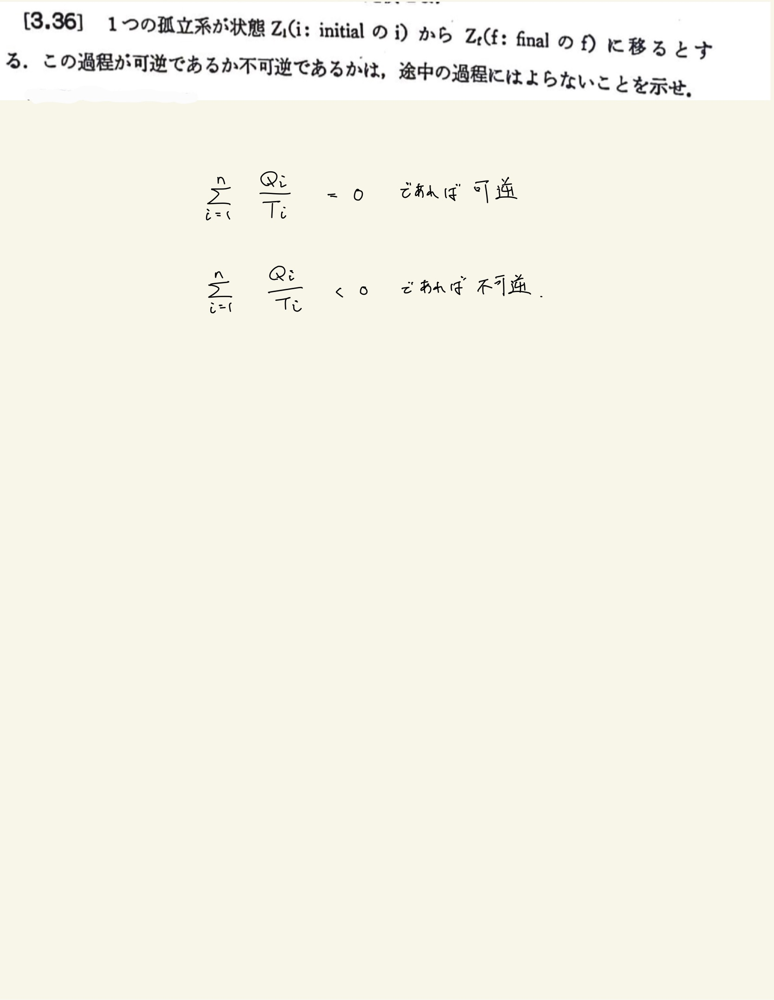

# 熱力学第2法則 エントロピー
## 3.36 可逆性

#### 解答

$Z_1$から任意の途中の過程$C$を経て可逆的に$Z_f$に移るものとする。このことは$Z_f$から出発して、$Z_1$にもどすのに、他の系を使ったとしても、その系はサイクル$C'$を描くことを意味する(他の系を使う必要のないときでも$C'$がサイクルを描く特別な場合と考えてよい)。$C'$が存在するかどうかは$C$がどのような過程であるかにはよらない。
 
 

